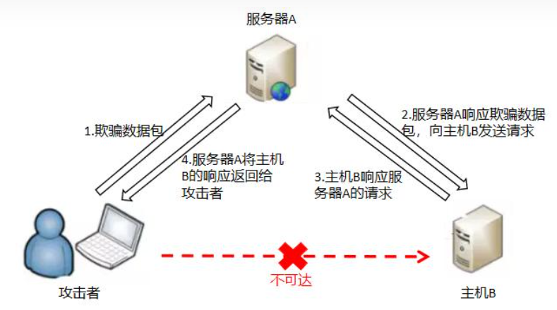
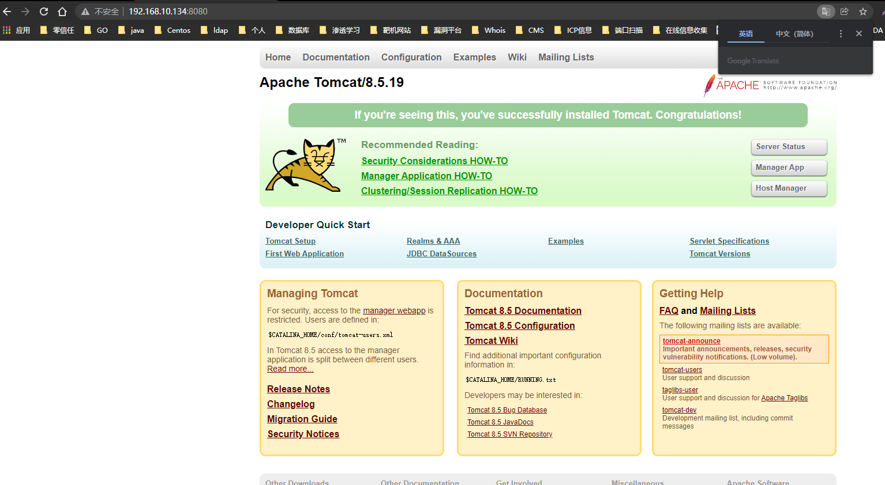
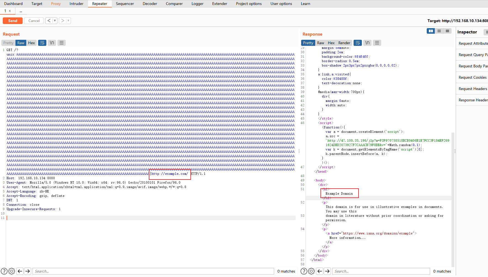
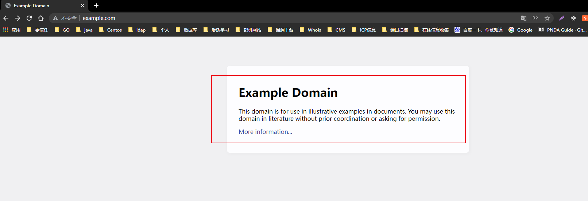
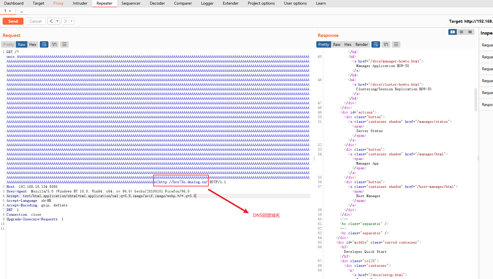
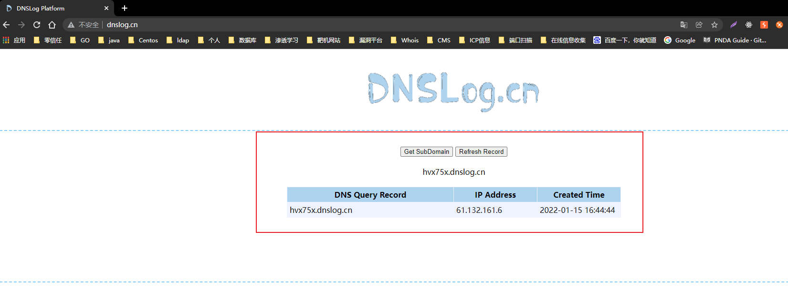

# 一、概述
* `CVE-2021-40438`是`apache http server` SSRF漏洞，SSRF漏洞即为：**服务端请求伪造漏洞**，指的是攻击者在未能取得服务器所有权限时，利用服务器漏洞以服务器的身份发送一条构造好的请求给服务器所在内网。SSRF攻击通常针对外部网络无法直接访问的内部系统。  
* 漏洞危害
    * SSRF可以对外网服务器所在内网、本地进行端口扫描，攻击运行在内网或本地的应用，或者利用File协议读取本地文件。
    * 内网服务防御相对外网服务来说一般会较弱，甚至部分内网服务为了运维方便并没有对内网的访问设置权限验证，所以存在SSRF时，通常会造成较大的危害。


# 二、影响版本
* Apache HTTP Server 2.4.48及以前的版本

# 三、靶场环境搭建
* 这里使用的是`vulhub`线下靶场进行复原
```
root@wq:/home/wq/vulhub-master/httpd/CVE-2021-40438# ls
1.png  docker-compose.yml  Dockerfile  README.md  README.zh-cn.md
root@wq:/home/wq/vulhub-master/httpd/CVE-2021-40438# pwd
/home/wq/vulhub-master/httpd/CVE-2021-40438
root@wq:/home/wq/vulhub-master/httpd/CVE-2021-40438# docker-compose build
root@wq:/home/wq/vulhub-master/httpd/CVE-2021-40438# docker-compose up -d
root@wq:/home/wq/vulhub-master/httpd/CVE-2021-40438# docker ps
CONTAINER ID   IMAGE                   COMMAND              CREATED             STATUS             PORTS                                   NAMES
ed0db113dbc6   cve-2021-40438_apache   "httpd-foreground"   About an hour ago   Up About an hour   0.0.0.0:8080->80/tcp, :::8080->80/tcp   cve-2021-40438_apache_1
6836b54c2ef0   vulhub/tomcat:8.5.19    "catalina.sh run"    About an hour ago   Up About an hour   8080/tcp                                cve-2021-40438_tomcat_1
```
* 靶场环境测试，发现可以正常访问
  

# 漏洞验证
* 使用`BP`进行抓包分析
  

* 使用`DNS LOG`回显进行再次测试，发现回显成功，验证漏洞存在
  
  

# 尝试对漏洞进行下一步利用
* SSRF可以漏洞的点很多，例如：使用http协议进行端口扫描，使用file协议进行文件浏览等等
* 由于自己比较菜，还未能达到一定水平利用，思路就是在服务器请求jpg，或者pdf等一些文件的时候，植入一些payload以达到控制服务端的攻击，继续。。。