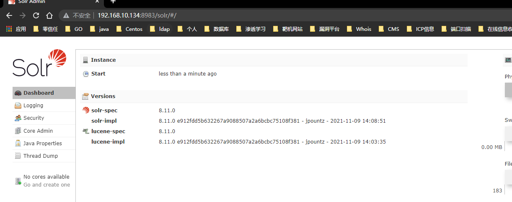
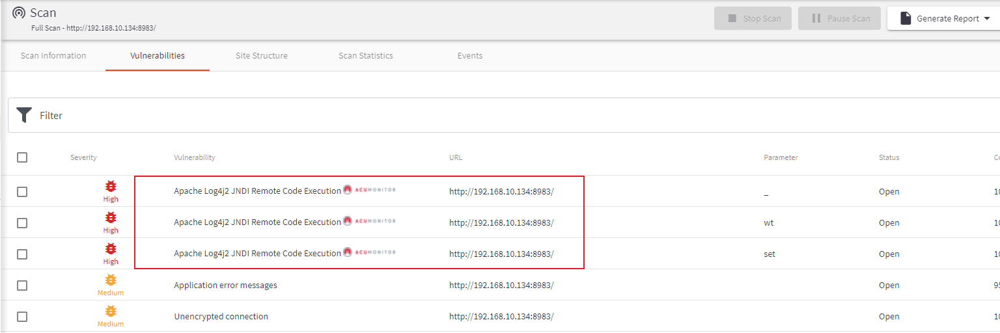

# 一、概述


# 二、影响版本


# 三、靶场环境搭建
* 这里我使用的是`Vulhub`线下靶场搭建
```
root@wq:/home/wq/vulhub/log4j/CVE-2021-44228# ls
1.png  2.png  docker-compose.yml  README.md  README.zh-cn.md
root@wq:/home/wq/vulhub/log4j/CVE-2021-44228# pwd
/home/wq/vulhub/log4j/CVE-2021-44228
root@wq:/home/wq/vulhub/log4j/CVE-2021-44228# docker-compose up -d
root@wq:/home/wq/vulhub/log4j/CVE-2021-44228# docker ps
CONTAINER ID   IMAGE                COMMAND                  CREATED      STATUS         PORTS                                       NAMES
10eef5927504   vulhub/solr:8.11.0   "/opt/solr/bin/solr …"   3 days ago   Up 3 seconds   0.0.0.0:8983->8983/tcp, :::8983->8983/tcp   cve-2021-44228_solr_1
root@wq:/home/wq/vulhub/log4j/CVE-2021-44228# 

```
* 开始访问：`http://192.168.10.134:8983/solr/#/`来测试靶场是否正常
  


# 四、漏洞复现

* 由于最近更新了`awvs`的所以这里用它扫一下
* 从扫描结果中发现确实存在漏洞：
  

# 五、总结


