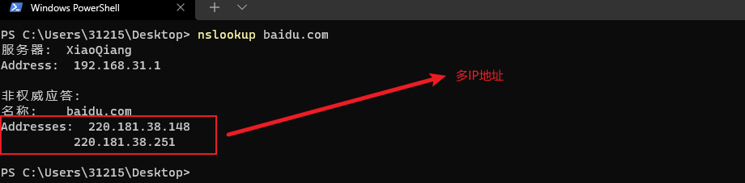
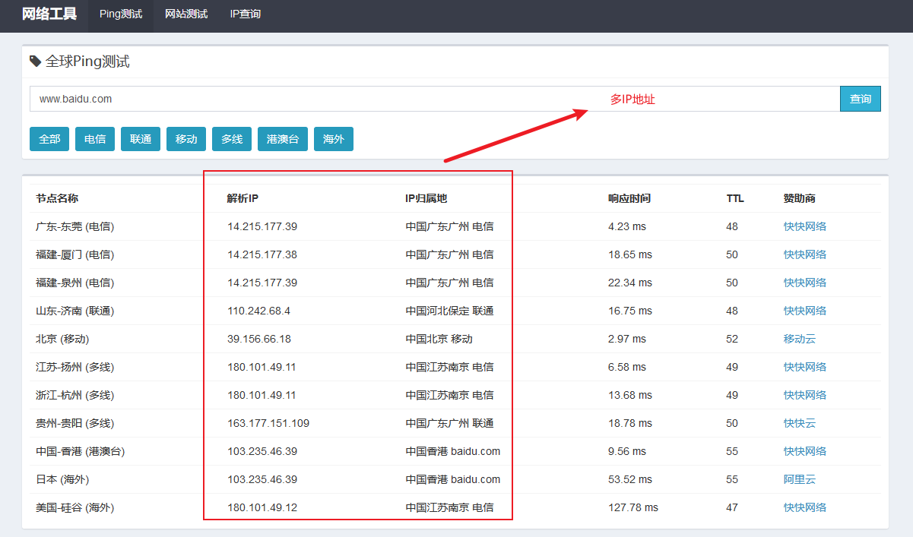
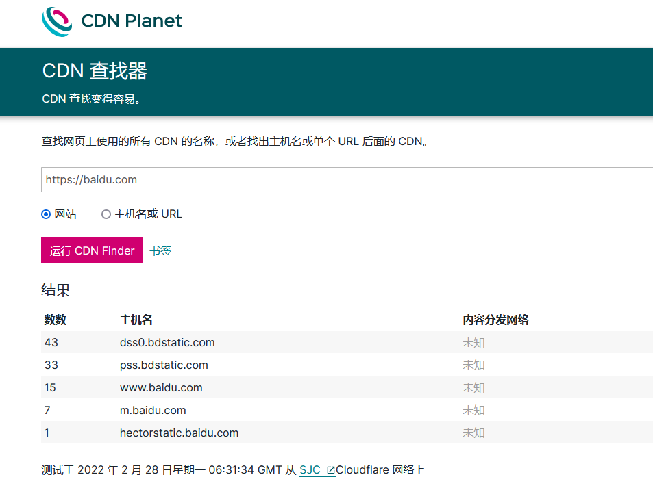

# 0x01 CND识别

## 1.CND存在判定

* nslookup查询：

  

* 在线多地ping

  

* CND在线查询

  

# 0x02 CDN绕过

* 手段一：利用CDN服务配置不当

  > 利用CDN配置不当绕过CDN，在常规配置CDN服务时，需要指定域名、端口信息等。
  >
  > * 案例一：在配置DNS服务时，经常将`www.test.com`与`test.com`解析到相同的服务器，但是在配置CDN时，如果配置不当可能会造成只有`www.test.com`接入CDN服务，但是`test.com`并未有接入CDN服务，从而达到绕过的。
  > * 案例二：站点同时接受HTTP与HTTPS服务时，但是CDN服务只是配置HTTP协议，此时可以通过HTTP请求绕过CDN

* 手段二：利用DNS历史解析记录判定

  > 利用DNS历史解析在线查询的方式，判定该域名以前的服务地址，进行尝试。
  >
  > 在线查询方式：
  >
  > * `iphistory`：https://viewdns.info/iphistory/
  > * `DNS查询`：https://dnsdb.io/zh-cn/
  > * `微步在线`：https://x.threatbook.cn/
  > * `域名查询`：https://site.ip138.com/
  > * `DNS历史查询`：http://tools.bugscaner.com/historydns.html
  > * `Netcraft`：https://sitereport.netcraft.com/

* 手段三：利用子域名绕过CDN

  > 通常情况下主域名和子域名在同一C段内时，当主域名服务判定已经存在CDN时，可以通过子域名查询，获取子域名服务IP的C段信息，进而查找站点的真是IP。
  >
  > 子域名查询方式：
  >
  > * 空间测绘引擎：
  >   * FOFA：https://fofa.so
  >   * 360
  >   * 钟馗之眼：https://www.zoomeye.org
  >   * shodan：https://www.shodan.io
  > * 在线查询网站：
  >   * https://phpinfo.me/domain
  >   * http://tool.chinaz.com/subdomain/
  >   * http://i.links.cn/subdomain/    
  >   * http://subdomain.chaxun.la/
  >   * http://searchdns.netcraft.com/
  >   * https://www.virustotal.com/
  >   * https://dnsdb.io/zh-cn/
  >   * https://x.threatbook.cn/
  > * 子域名爆破工具：
  >   * `Layer子域名挖掘机`
  >   * `wydomain`：https://github.com/ring04h/wydomain
  >   * `subDomainsBrute`:https://github.com/lijiejie/
  >   * `Sublist3r`:https://github.com/aboul3la/Sublist3r

* 手段四：利用SSL证书信息获取真实IP

  > 可以使用自访问域名时获取的证书，反向追寻应用服务的真是IP，原理就是真实服务IP与CDN服务厂商也需要做SSL认证，此时真实服务器443端口连接CDN厂商IP时，SSL证书就会暴露。
  >
  > SSL证书获取IP查询方式：
  >
  > * `censys`：https://search.censys.io/

* 手段五：利用国外域名解析服务器解析域名IP

  > CDN是收费的业务，大部分国内的业务只是做了国内的CDN线路，并未做国外的线路。此时可以利用全球ping去发现一些不同的IP地址。
  >
  > 在线全球ping查询方式：
  >
  > * https://whoer.net/zh/ping
  > * https://ping.pe/

* 手段六：利用网站主动请求获取应用服务IP

  > 利用网站漏洞获取服务IP，通常是利用服务端主动请求客户端的原理获取src的IP。
  >
  > 通常采用的方式：
  >
  > * 利用应用服务注册或者修改密码时，自己注册邮箱接收到验证信息，分析邮件头信息
  > * 利用应用服务本身存在的漏洞信息，当应用服务反向请求自身服务时记录源IP信息

* 手段七：利用网站遗留文件获取应用服务真实IP

  > 网站本身存在一些遗留文件，这些文件中可能包含一些域名地址信息。
  >
  > 分析遗留文件：
  >
  > * 使用爬虫工具获取整个目录树结构，分析js中可能存在的信息泄露，特别是域名、IP
  > * 使用目录爆破工具分析是否存在一些.back、phpinfo.php等一些敏感文件，对其分析。

* 手段八：利用网站logo的hash值进行网络空间测绘

  > 利用大型网站的logo.ico、favicon.ico的hash值来进行空间搜索
  >
  > 利用工具：
  >
  > * 网站图片探测工具
  > * hash计算脚本
  > * 空间引擎搜索

* 手段九：利用扫全网工具绕过CDN

  > 利用一些扫描工具对全网IP进行扫描
  >
  > 常用工具：
  >
  > * `w8fuckcdn`：https://github.com/5up3rc/w8fuckcdn.git
  > * `xcdn`：https://github.com/3xp10it/xcdn.git

# 0x03 CDN绕过验证

## 1.IP+端口直接访问

利用获取的IP直接使用IP+端口在浏览器直接访问

## 2. 修改hosts指定IP访问

修改本地hosts文件后，指定IP，再次使用ping的方式验证ping信息是否为指定ip，之后使用浏览器使用域名访问。

## 3. 利用在线CDN识别

利用收集到的子域名或者CDN配置不当的域名进行在线校验，判断其是否存在CDN