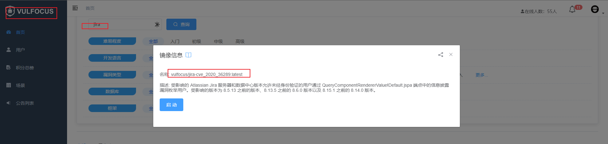
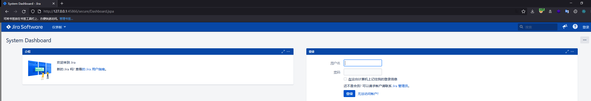
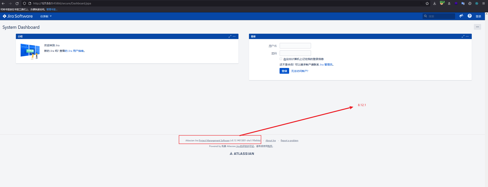

# 0x01 Jira漏洞概述
​		Atlassian JIRA Server和Atlassian JIRA Data Center都是澳大利亚Atlassian公司的产品。Atlassian JIRA Server是一套缺陷跟踪管理系统的服务器版本。该系统主要用于对工作中各类问题、缺陷进行跟踪管理。Atlassian JIRA Data Center是Atlassian JIRA的数据中心版本。 Atlassian Jira Server and Data Center存在安全漏洞。攻击者可以利用该漏洞枚举用户。
# 0x02 影响版本
    Jira < 7.13.6  
    Jira 8.0.0 - 8.5.7  
    Jira 8.6.0 - 8.12.0

# 0x03 漏洞环境部署

此环境在`vulfocus`已有，无需再次手动部署。
  
  

# 0x04 漏洞验证
* 在开启环境后可以明显发现一个版本信息
  

* 此时对于该版本信息尝试做漏洞复现，此版本中存在一个用户枚举漏洞尝试访问

