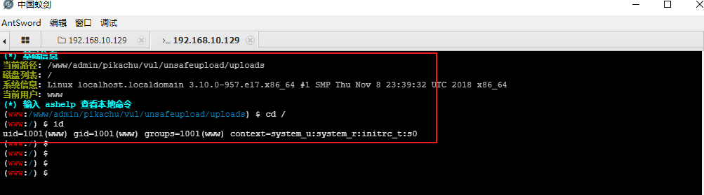
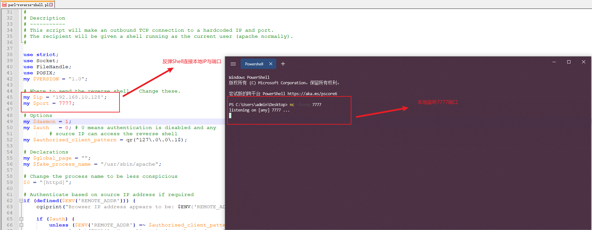

# 0x01 背景

通常获取的`webshell`的权限是比较低得，通常为应用服务本身的权限，只能去执行一些普通命令，此时就需要进行提权操作

# 0x02 创建交互shell

* `Linux`提权需要交互`shell`

* 通常使用以下方法：

  > 1. 使用工具`per-reverse-shell.pl`建立sockets通信
  > 2. 本地利用`netcat`进行监听`nc -lvvp 7777`

